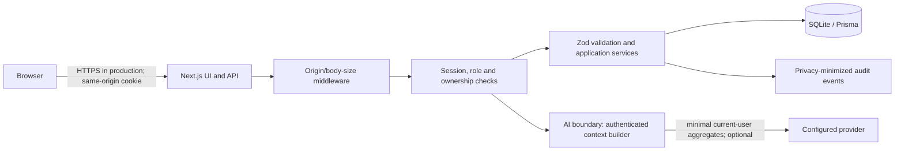

# FinTrack Security Architecture

## Status and scope

This describes the checked-in implementation, not a certification. Scanner status is recorded in `security-reports/` only after a scanner actually runs. See `SECURITY_SCORECARD.md` for verified versus unverified work.

## Architecture and trust boundaries

The browser has no database connection and does not receive server encryption keys. The provider integration is server-side; it receives a bounded monthly context and user question only when the user configures a provider key. The model has no database, shell, filesystem, admin API, or arbitrary-HTTP tools.

## Authentication and authorization

- Passwords use bcrypt hashes.
- Sessions use a signed JWT containing a server-generated session identifier, backed by a database session record. Logout deletes the record; lookup also checks expiry and account-enabled state.
- The cookie is HttpOnly and SameSite=Lax; `Secure` is added in production. Production refuses missing or shorter-than-32-character `JWT_SECRET` and `AI_KEY_SECRET`.
- API handlers derive the user identity from the session. Admin routes require the server-side ADMIN role. User-owned reads and mutations filter on `userId`.
- Mutating browser API requests with an Origin header must match the request origin; absent Origin remains supported for non-browser clients. JSON bodies are bounded to 32 KiB and parsed against route-specific Zod schemas.
- Login has an account-keyed process-local progressive lockout. Login/registration IP throttles and audit IP attribution use `X-Real-IP`/`X-Forwarded-For` only when `TRUST_PROXY=true`; only enable it behind an ingress that overwrites those headers. Otherwise client-supplied forwarding headers are ignored and IP-based throttling is disabled. Limits are process-local, not distributed.

## Data, secrets, and privacy

- Financial amounts are persisted as integer paise in SQLite through Prisma.
- AI provider keys are encrypted at rest using AES-256-GCM and `AI_KEY_SECRET`; APIs return a masked form only. The encryption secret must be separately supplied in production.
- Errors hide internal exception details. Audit events omit passwords, request bodies, AI keys, and failed-login email metadata.
- Exports are scoped to the authenticated user. Users can delete their account and remove AI configuration in the application.

## API and browser controls

The application configures CSP, `frame-ancestors 'none'`, `object-src 'none'`, `base-uri 'self'`, `form-action 'self'`, HSTS in production, `X-Content-Type-Options`, referrer policy, and a restrictive permissions policy. CSP retains `unsafe-inline` for current Next.js compatibility; `unsafe-eval` is not allowed.

The application does not implement a general distributed API gateway, WAF, or general per-route rate limiter. Deploy behind a TLS-terminating trusted ingress with request-size, connection, and rate limits; configure it to replace untrusted forwarding headers. Do not expose the application directly to the public internet without that layer.

## Database and deployment

Prisma supplies parameterized database operations and queries are scoped to the authenticated user. The Docker image uses a multi-stage build, runs as a non-root account, stores SQLite in a persistent volume, and has a read-only root filesystem, no added Linux capabilities, no-new-privileges, resource bounds, and a health check. TLS must be terminated by an authorized HTTPS ingress; the compose file is not itself a TLS terminator.

## Verification

Use `npm run security:test`, `npm run security:semgrep`, `npm run security:gitleaks`, `npm run security:osv`, `npm run security:trivy`, and `npm run security:sbom`. `npm run security:zap`, `npm run security:nuclei`, and `npm run security:trivy:image` need Docker and a local QA target/image. Do not describe any scanner as passed until its command has completed and its report is present.
