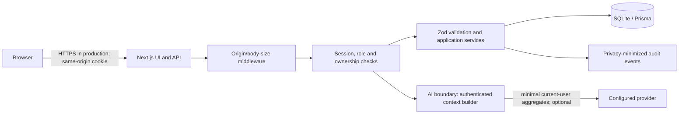

# FinTrack Security Architecture

## Status and scope

This describes the checked-in implementation, not a certification. Scanner status is recorded in `security-reports/` only after a scanner actually runs. See `SECURITY_SCORECARD.md` for verified versus unverified work.

## Architecture and trust boundaries

The browser has no database connection and does not receive server encryption keys. The provider integration is server-side; it receives a bounded monthly context and user question only when the user configures a provider key. Free-text transaction descriptions and notes are excluded from that context. The model has no database, shell, filesystem, admin API, or arbitrary-HTTP tools.

## Authentication and authorization

- Passwords use bcrypt hashes.
- Sessions use a signed JWT containing a server-generated session identifier, backed by a database session record. Logout deletes the record; lookup also checks expiry and account-enabled state.
- The cookie is HttpOnly and SameSite=Lax; `Secure` is added in production. Server modules fail at startup if `JWT_SECRET` or `AI_KEY_SECRET` is missing or shorter than 32 characters; development has no hard-coded fallback.
- API handlers derive the user identity from the session. Admin routes require the server-side ADMIN role. User-owned reads and mutations filter on `userId`.
- Mutating API requests require matching Origin and Host plus `Content-Type: application/json`. JSON bodies are bounded to 32 KiB and parsed against route-specific strict Zod schemas.
- Login has an account-keyed process-local progressive lockout. Login/registration IP throttles and audit IP attribution use `X-Real-IP`/`X-Forwarded-For` only when `TRUST_PROXY=true`; only enable it behind an ingress that overwrites those headers. Otherwise client-supplied forwarding headers are ignored and IP-based throttling is disabled. Limits are process-local, not distributed.
- Change-password, account deletion, exports, reports, and AI requests also have per-process limits. The application does not advertise wildcard CORS.

## Data, secrets, and privacy

- Financial amounts are persisted as integer paise in SQLite through Prisma.
- Dashboard analytics are date-bounded to the requested 1/3/6/12-month range and the signed-in user's records. Optional sample history is per-user, explicitly confirmed, idempotent, and additive; no reset endpoint exists.
- AI provider keys are encrypted at rest using AES-256-GCM and `AI_KEY_SECRET`; APIs return a masked form only. The encryption secret must be separately supplied in production.
- Errors hide internal exception details. Audit events omit passwords, request bodies, AI keys, and failed-login email metadata.
- Exports are scoped to the authenticated user. Users can delete their account and remove AI configuration in the application.

## API and browser controls

The application configures CSP, `frame-ancestors 'none'`, `object-src 'none'`, `base-uri 'self'`, `form-action 'self'`, HSTS in production, `X-Content-Type-Options`, referrer policy, and a restrictive permissions policy. CSP retains `unsafe-inline` for current Next.js compatibility; `unsafe-eval` is not allowed.

The application does not implement a distributed API gateway, WAF, or distributed rate limiter. Deploy behind a TLS-terminating trusted ingress with request-size, connection, and rate limits; configure it to replace untrusted forwarding headers. Do not expose the application directly to the public internet without that layer.

## Database and deployment

Prisma supplies parameterized database operations and queries are scoped to the authenticated user. The Dockerfile defines a multi-stage build and non-root runtime with a health check. Docker was unavailable in the verification environment, so no image build or image scan is claimed. TLS must be terminated by an authorized HTTPS ingress.

## Verification

Evidence for the executed tests and scanners is checked into `security-reports/`. The custom suite currently passes 37 tests; the isolated production-mode Playwright journey passed 2 tests and verified persistence through reload/navigation/logout/login. Semgrep, Gitleaks, OSV, and Trivy results are refreshed after the final code changes; see the actual report files and scorecard. Docker was not installed, so image Trivy, ZAP and Nuclei were not run. Do not describe unavailable scans as passes.
