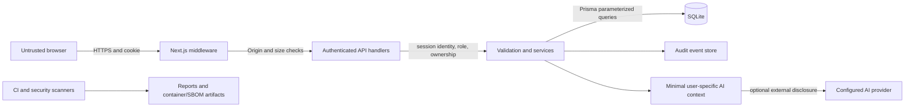

# FinTrack STRIDE Threat Model

## Assets

1. Transaction descriptions, amounts, categories, dates, budgets, goals, investment records, and exports.
2. User credentials, session records, AI-provider keys and encryption key.
3. Integrity and availability of SQLite data, audit events, API and dashboard.
4. Build provenance, dependency lockfile, container image, and release artifacts.

## Actors and assumptions

- Anonymous internet client; authenticated user; administrator; database/file-system operator; configured AI provider; CI runner; authorized QA scanner.
- Users may be malicious and may submit hostile text or JSON. The AI provider and all user text are untrusted.
- Production must supply strong secrets and terminate HTTPS at a trusted ingress. In-memory throttles are single-process; this is not a distributed service.

## Trust boundaries and data flows

**Boundaries:** browser/server; unauthenticated/authenticated; user/admin; application/database; application/provider; source/CI output; container runtime/host. No browser-to-database path exists.

## Attack surfaces

Login/register/password-change; cookie-bearing mutation APIs; IDs and query parameters; user-controlled descriptions/notes/categories/profile fields; reports and exports; AI question/context and encrypted key configuration; market-data outbound fetch; SQLite file and backups; deployment ingress and container; npm dependency and CI supply chain.

## STRIDE analysis

| STRIDE | Threat examples | Implemented controls | Residual risk |
|---|---|---|---|
| **Spoofing** | Credential theft, brute force, session replay, forged forwarding headers | bcrypt; signed expiring JWT plus database session; logout revocation; HttpOnly/SameSite cookie; production Secure cookie; progressive account lockout; forwarding headers trusted only with `TRUST_PROXY=true` | No MFA or password-reset flow; distributed throttling absent; proxy trust depends on ingress configuration |
| **Tampering** | Change another user's transaction, alter amount/category/role, malformed JSON | User-scoped Prisma writes; admin role checked on server; strict Zod schemas; integer-paise bounds; JSON size cap; Origin/Host and JSON content-type checks | Database/file-system operator remains trusted; no immutable ledger or transaction signing |
| **Repudiation** | Deny transaction or security-setting change | Mutation/auth audit events record action and actor; metadata excludes request body and credentials | Audit writes are best-effort and local database records are mutable by DB operators; no external append-only log |
| **Information Disclosure** | IDOR/BOLA, cross-user exports, XSS, AI context leakage, secrets in errors/logs | Ownership filters; cross-user tests; current-user export; React text rendering; generic errors; encrypted AI key; AI context excludes free-text transaction descriptions/notes and is user-scoped; no model tools | A configured provider receives current-user aggregates and non-free-text context; CSP permits inline scripts for Next.js; backups/host access need separate protection |
| **Denial of Service** | Login/API/AI flooding, large JSON, expensive reports | bounded parsed JSON and declared length; per-process login, registration, account, password, export, report, and AI limits; bounded pagination | Process-local throttles reset/restart and do not coordinate; no global concurrency quota or ingress was assessed |
| **Elevation of Privilege** | User becomes admin, accesses admin/data IDs, JWT/session forgery | Server-controlled role; `requireRole`; JWT signature and session-record checks; ownership-scoped operations; RBAC/BOLA tests; admin self/last-admin protections | No MFA; only local seeded admin created when a fictional non-production password is explicitly configured |

## Security controls and verification

Implemented controls are enforced in application code and tests; pending scanners are not represented as successful. See `SECURITY_TESTING.md`, `RASP.md`, and `SECURITY_SCORECARD.md`. Focused tests use fictional data and local test databases.

## Residual risk acceptance

No unverified risk is labeled accepted as safe. Available npm audit, OSV, and Trivy filesystem/config scans reported no findings in their configured scope. Runtime rate limiting is not distributed; production ingress/TLS was not assessed; image scanning, ZAP, Nuclei, and IAST remain unverified. Do not deploy publicly until production controls and DAST/image coverage are addressed.
